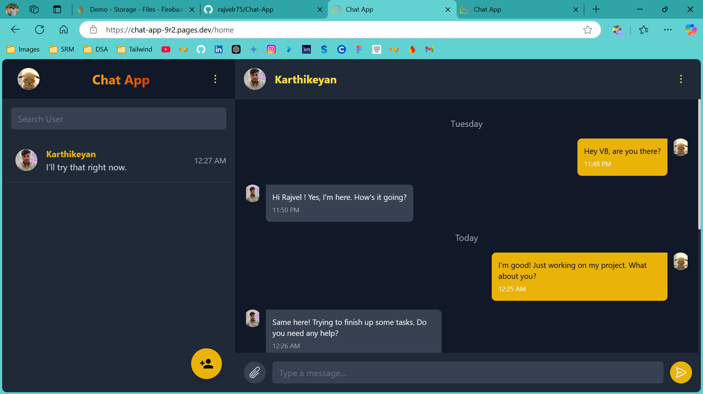
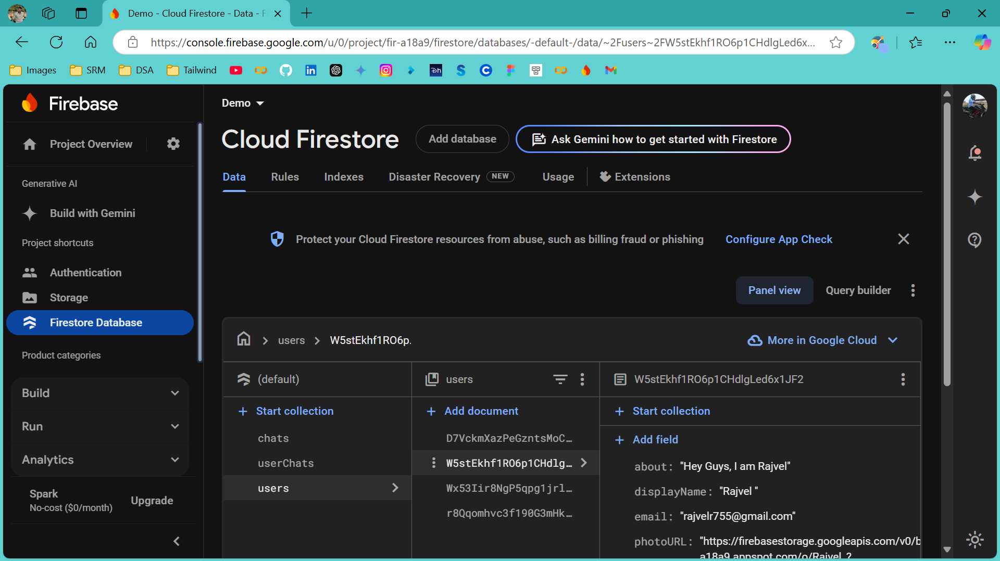

Chat App
A real-time web chat application built with modern web technologies to facilitate seamless communication. This project showcases features like user authentication, instant messaging, media Sharing and a responsive user interface.

🚀 Features
Real-Time Messaging: Send and receive messages instantly.
User Authentication: Secure login and registration using Firebase.
Responsive Design: Fully responsive UI, optimized for desktop and mobile devices.
User-Friendly Interface: Clean and modern design for an excellent user experience.
Scalability: Built with scalable architecture to support multiple concurrent users.
🛠️ Tech Stack
Frontend: React.js, Tailwind CSS
Backend: Javascript
Database: Firebase
Authentication: Firebase
Deployment: Cloudfare
📸 Screenshots
Home Page

Chat Interface

🔧 Installation
Clone the repository:
bash
Copy code
git clone https://github.com/rajvelr75/Chat-App.git
Navigate to the project directory:
bash
Copy code
cd Chat-App
Install dependencies:
bash
Copy code
npm install
Configure environment variables:
Create a .env file in the root directory.
Add the following keys:
env
Copy code
REACT_APP_API_URL=<your_backend_api_url>
SOCKET_SERVER_URL=<your_socket_server_url>
Start the development server:
bash
Copy code
npm start
🖥️ Usage
Open the application in your browser at http://localhost:3000.
Sign up or log in to your account.
Start chatting with other users in real time!
📂 Folder Structure
java
Copy code
Chat-App/
├── public/
├── src/
│   ├── components/
│   ├── pages/
│   ├── utils/
│   ├── App.js
│   ├── index.js
│   └── styles.css
├── .env
├── package.json
└── README.md

🌟 Features in Detail
Authentication: Secure user authentication to ensure privacy.
Message History: View past messages with users.
🚀 Live Demo
Check out the live version here: Chat App Live Demo

https://chat-app-9r2.pages.dev/login

🤝 Contributing
Contributions are welcome! Here's how you can get started:

Fork the repository.
Create a new branch:
bash
Copy code
git checkout -b feature-name
Commit your changes:
bash
Copy code
git commit -m 'Add a feature'
Push to the branch:
bash
Copy code
git push origin feature-name
Submit a pull request.
📜 License
This project is licensed under the MIT License.

📧 Contact
Author: Rajvel S
Email: rajvelr755@gmail.com
GitHub: https://github.com/rajvelr75
